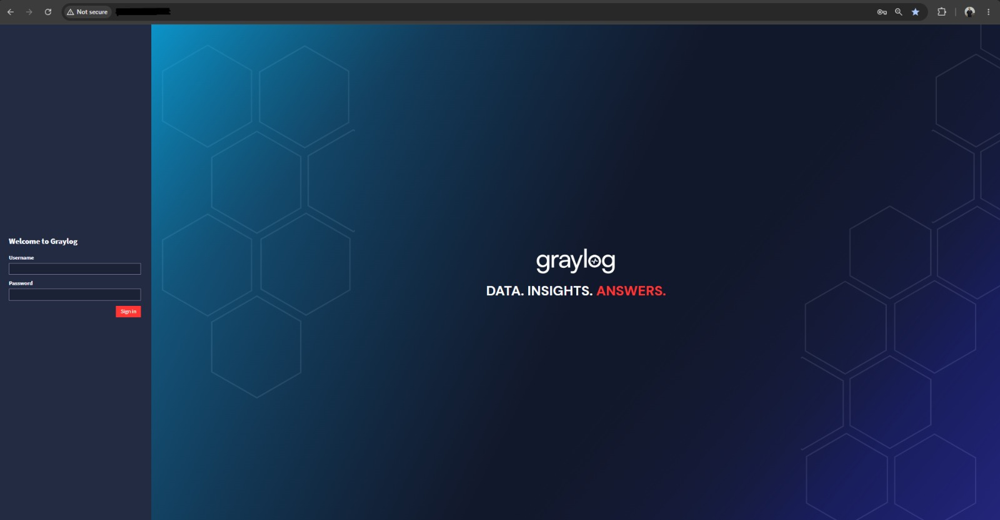
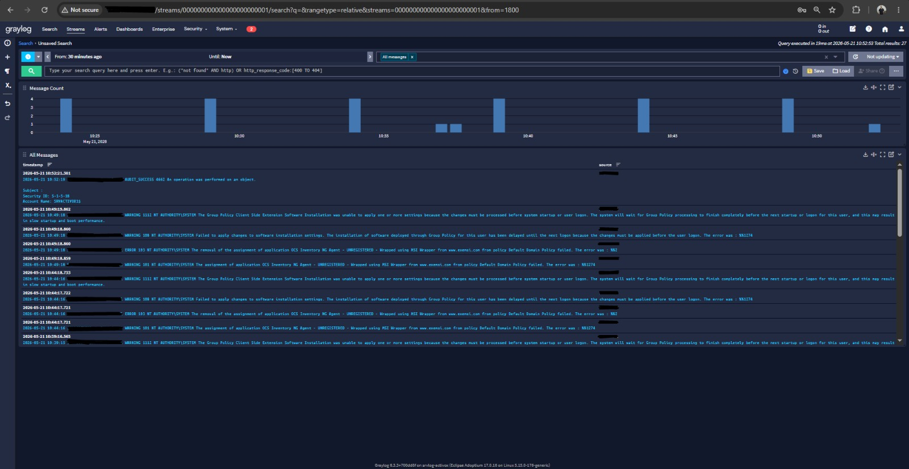

# 📊 Graylog — SIEM / Centralizador de Logs

> Implantação em ambiente de produção de solução **SIEM** para centralização, correlação e análise de logs de segurança da organização.

---

<div align="center">


</div>

---

## 📋 Sobre o Projeto

O **Graylog** foi implantado como solução central de **Security Information and Event Management (SIEM)** da organização, permitindo a ingestão, armazenamento e análise em tempo real de eventos gerados por servidores, estações e ativos de rede.

---

## ⚙️ Stack Utilizada

| Componente | Tecnologia |
|-----------|-----------|
| **SIEM** | Graylog 5.x |
| **Banco de dados** | MongoDB |
| **Motor de busca** | OpenSearch / Elasticsearch |
| **Protocolo de ingestão** | Syslog UDP · GELF · Beats |
| **Sistema Operacional** | Linux |

---

## 🎯 O que foi implantado

- Servidor Graylog configurado e integrado à infraestrutura da organização
- Ingestão de logs de múltiplas fontes (Active Directory, servidores Windows/Linux, ativos de rede)
- Dashboard de monitoramento com visibilidade em tempo real de eventos de segurança
- Streams configurados para separação de fontes por tipo de log
- Autenticação e controle de acesso ao console web

---

## 📸 Evidências

### Login — Console Web


---

### Dashboard — Stream de Mensagens em Tempo Real


> Console exibindo stream de eventos dos últimos 30 minutos com 27 resultados. Logs visíveis incluem eventos de `AUDIT_SUCCESS`, `WARNING` de Group Policy e erros de instalação do agente OCS via MSI Wrapper — demonstrando integração entre os dois sistemas implantados.

---

## 📁 Estrutura da pasta

```
graylog/
├── README.md
└── evidence/
    ├── graylog_login.jpeg      # Tela de login do console Graylog
    └── graylog_dashboard.jpeg  # Dashboard com stream de logs em produção
```

---

<sub>🔙 <a href="../README.md">Voltar para Infrastructure</a> · <a href="../../README.md">Voltar ao README principal</a></sub>
