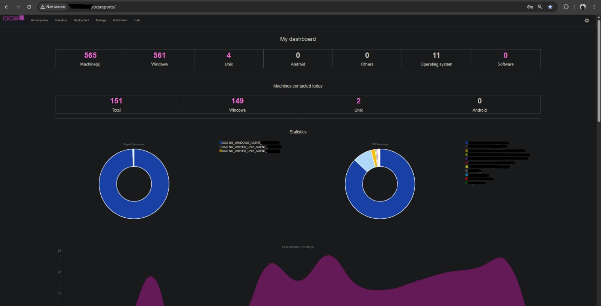

# 🖥️ OCS Inventory NG — Gestão de Ativos

> Implantação em ambiente de produção de solução de **inventário e gestão de ativos** para mapeamento completo do parque tecnológico da organização.

---

<div align="center">


</div>

---

## 📋 Sobre o Projeto

O **OCS Inventory NG** (Open Computers and Software Inventory Next Generation) foi implantado como solução de **gestão e inventário de ativos** da organização, proporcionando visibilidade total sobre hardware, software e sistemas operacionais de todas as máquinas do ambiente.

---

## ⚙️ Stack Utilizada

| Componente | Tecnologia |
|-----------|-----------|
| **Inventário** | OCS Inventory NG 2.x |
| **Banco de dados** | MySQL / MariaDB |
| **Backend** | PHP / Apache |
| **Agentes** | OCS-NG Windows Agent · OCS-NG Unified Unix Agent |
| **Sistema Operacional** | Linux (servidor) |

---

## 🎯 O que foi implantado

- Servidor OCS Inventory NG configurado com console web de gerenciamento
- Deploy de agentes em **565 máquinas** do parque tecnológico (561 Windows · 4 Unix)
- Inventário automático de hardware, software e sistema operacional
- Dashboard com estatísticas de versões de agentes e SOs
- Monitoramento de contato diário: **151 máquinas ativas** no dia da coleta
- Distribuição de software via deployment integrado ao servidor

---

## 📊 Estatísticas do Ambiente

| Métrica | Valor |
|--------|-------|
| Total de máquinas inventariadas | **565** |
| Máquinas Windows | **561** |
| Máquinas Unix/Linux | **4** |
| Sistemas operacionais distintos | **11** |


---

## 📸 Evidências

### Login — Console Web


---

### Dashboard — Visão Geral do Parque Tecnológico


> Dashboard exibindo o inventário completo: 565 máquinas cadastradas, distribuição por sistema operacional e versões de agentes. O gráfico de linha exibe o histórico de contato das máquinas nos últimos 15 dias.

---

## 📁 Estrutura da pasta

```
ocs-inventory/
├── README.md
└── evidence/
    ├── ocs_login.jpeg        # Tela de login do console OCS
    └── ocs_dashboard.jpeg    # Dashboard com inventário em produção
```

---

<sub>🔙 <a href="../README.md">Voltar para Infrastructure</a> · <a href="../../README.md">Voltar ao README principal</a></sub>
