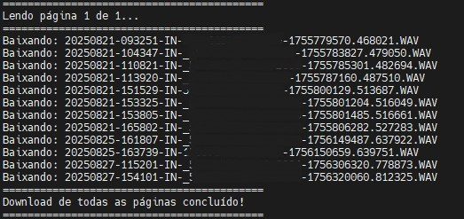
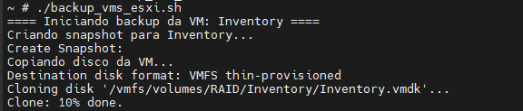

# 🖥️ Bash Scripts

Scripts shell para automação de tarefas de infraestrutura e operações.

---

## 📋 Índice

| Script | Descrição | Tecnologia | Status |
|--------|-----------|------------|--------|
| [getrecords.sh](#-getrecordssh--download-de-gravações-fortics-pbx) | Download de gravações via API | Fortics PBX | 🟢 Ativo |
| [backup_vms_esxi.sh](#-backup_vms_esxish--backup-de-vms-vmware-esxi) | Backup automatizado de VMs | VMware ESXi | 🟢 Ativo |

---

## 📥 getrecords.sh — Download de Gravações (Fortics PBX)

> Script que realiza download automatizado de gravações de chamadas via API do servidor **Fortics PBX**.

### ⚙️ O que faz
- Conecta na API do Fortics PBX com autenticação
- Pagina os resultados automaticamente (página a página)
- Faz download dos arquivos `.WAV` listados
- Exibe progresso em tempo real e confirma conclusão

### 🚀 Uso
```bash
chmod +x getrecords.sh
./getrecords.sh
```

### 📸 Evidência de Execução



### 🔗 Script
👉 [getrecords.sh](getrecords.sh)

---

## 💾 backup_vms_esxi.sh — Backup de VMs (VMware ESXi)

> Script que realiza backup automatizado de máquinas virtuais em um servidor **VMware ESXi**.

### ⚙️ O que faz
- Conecta via SSH no host ESXi
- Lista as VMs disponíveis no servidor
- Exporta os arquivos de disco das VMs (`.vmdk`)
- Armazena os backups em diretório configurável
- Registra log de execução com data e status

### 🚀 Uso
```bash
chmod +x backup_vms_esxi.sh
./backup_vms_esxi.sh
```

### 📸 Evidência de Execução



### 🔗 Script
👉 [backup_vms_esxi.sh](backup_vms_esxi.sh)

---

## 📁 Estrutura da pasta

```
bash/
├── getrecords.sh               # Download de gravações via API Fortics PBX
├── backup_vms_esxi.sh          # Backup de VMs no VMware ESXi
├── evidence/
│   ├── getrecords-output.png   # Print da execução do getrecords.sh
│   └── backup_vms_esxi-output.png  # Print da execução do backup
└── README.md                   # Este arquivo
```

---

<sub>🔙 <a href="../../README.md">Voltar ao README principal</a></sub>
